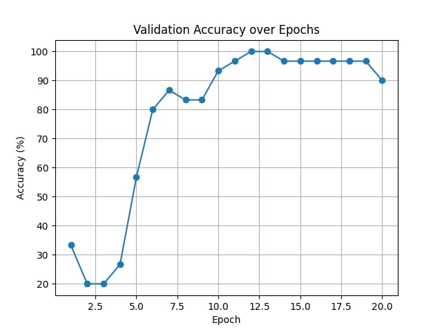
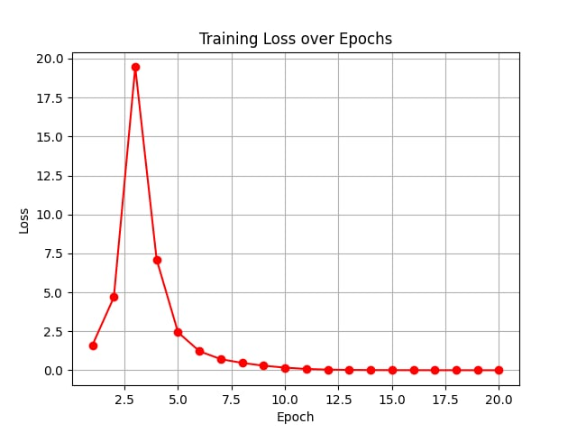

# Malware Classification Using Grayscale Images and CNN

> Student Name: Hayden Chang 張皓鈞
> Student ID: B11030202
> Date: Oct. 10, 2024

## 1. Grayscale Image Conversion

```python
import os
import numpy as np
from PIL import Image
from typing import Union


def convert_to_grayscale_image(input_folder: str, output_folder: str) -> None:
```

This function is designed to convert malware binary files into grayscale images. It takes two parameters:

- `input_folder`: The directory containing the malware binary files.
- `output_folder`: The directory where the grayscale images will be saved.

### Folder and File Iteration

```python
    # Iterate through each subfolder
    for parent_dir in os.listdir(input_folder):
        parent_path = os.path.join(input_folder, parent_dir)
        if os.path.isdir(parent_path):
            # Create a corresponding output folder
            output_parent_path = os.path.join(output_folder, parent_dir)
            os.makedirs(output_parent_path, exist_ok=True)

            # Iterate through each file
            for file_name in os.listdir(parent_path):
                file_path = os.path.join(parent_path, file_name)

                if os.path.isfile(file_path):
                    # Read the binary content of the file
                    with open(file_path, "rb") as file:
                        byte_content: bytes = file.read()
```

This part iterates through each subdirectory in the `input_folder`, checks if it’s a valid directory, and creates a corresponding folder in the `output_folder` to store the grayscale images. For each file in the directory, it reads the binary content of the file.

### Binary to Grayscale Image Conversion

```python
                    # Convert the binary content to an 8-bit vector
                    byte_array: np.ndarray = np.frombuffer(byte_content, dtype=np.uint8)

                    # Use the square root of the binary array's length, rounding up, as the side length
                    image_side: int = int(np.ceil(np.sqrt(len(byte_array))))
                    padded_array: np.ndarray = np.pad(
                        byte_array,
                        (0, image_side * image_side - len(byte_array)),
                        mode="constant",
                    )

                    # Convert to a 2D array and generate a grayscale image
                    gray_image_array: np.ndarray = padded_array.reshape(
                        (image_side, image_side)
                    )
                    gray_image: Image.Image = Image.fromarray(gray_image_array, "L")
```

Here, the binary content is transformed into an array of 8-bit unsigned integers. The length of the array is used to determine the side length of the resulting square image. The array is padded to ensure the final image is square. Then, the array is reshaped into a 2D format and converted into a grayscale image.

### Saving the Grayscale Image

```python
                    # Save the grayscale image
                    output_image_path: str = os.path.join(
                        output_parent_path, f"{os.path.splitext(file_name)[0]}.png"
                    )
                    gray_image.save(output_image_path)
                    print(f"Saved {output_image_path}")
```

After the grayscale image is generated, it’s saved to the output directory in PNG format.

### Running the Function

```python
# Specify input and output folders
input_folder = "C:\\Users\\hayden\\.conda\\envs\\virus_pic\\gray_virus\\PEs"  # Replace with your input folder path
output_folder = "C:\\Users\\hayden\\.conda\\envs\\virus_pic\\gray_virus\\output_image"  # Replace with your output folder path
os.makedirs(output_folder, exist_ok=True)

convert_to_grayscale_image(input_folder, output_folder)
```

This part sets up the input and output directories and runs the `convert_to_grayscale_image` function.

---

## 2. CNN Model for Malware Classification

```python
import os
import torch
import torch.nn as nn
import torch.optim as optim
import torchvision.transforms as transforms
import torchvision.datasets as datasets
from torch.utils.data import DataLoader, random_split, Subset
import matplotlib.pyplot as plt
from tqdm import tqdm
from sklearn.model_selection import train_test_split
from typing import List, Tuple
```

This part imports the necessary libraries for the CNN model, including PyTorch for model building, optimization, and training, and `tqdm` for tracking progress.

### Setting Hyperparameters

```python
# Set hyperparameters
batch_size: int = 512
learning_rate: float = 50e-4
num_epochs: int = 20
image_size: Tuple[int, int] = (128, 128)  # Adjust according to your image size
```

Here, the batch size, learning rate, number of epochs, and the size of the images are set.

### Data Preprocessing

```python
# Dataset path
data_dir: str = (
    "C:\\Users\\hayden\\.conda\\envs\\virus_pic\\gray_virus\\class_5_output_image"
)
model_path: str = (
    "C:\\Users\\hayden\\.conda\\envs\\virus_pic\\gray_virus\\cnn_model.pth"
)

# Data preprocessing
transform: transforms.Compose = transforms.Compose(
    [
        transforms.Grayscale(num_output_channels=1),  # Ensure the image is grayscale
        transforms.Resize(image_size),  # Resize the image to a uniform size
        transforms.ToTensor(),  # Convert the image to a tensor
        transforms.Normalize((0.5,), (0.5,)),  # Normalize
    ]
)
```

The images are loaded from the specified directory and preprocessed. Each image is resized to 128x128, converted to a grayscale tensor, and normalized with a mean and standard deviation of 0.5.

### Loading the Dataset

```python
# Load the entire dataset
full_dataset: datasets.ImageFolder = datasets.ImageFolder(
    root=data_dir, transform=transform
)

# Get all labels
labels: List[int] = [label for _, label in full_dataset]

train_indices: List[int]
val_indices: List[int]
train_indices, val_indices = train_test_split(
    range(len(labels)),
    test_size=0.3,  # 30% of the data for the validation set
    stratify=labels,  # Stratified sampling based on labels
    random_state=42,  # Fixed random seed
)

# Create the split datasets
train_dataset: Subset = Subset(full_dataset, train_indices)
val_dataset: Subset = Subset(full_dataset, val_indices)

# Create DataLoader
train_loader: DataLoader = DataLoader(
    dataset=train_dataset, batch_size=batch_size, shuffle=True
)
val_loader: DataLoader = DataLoader(
    dataset=val_dataset, batch_size=batch_size, shuffle=False
)

print(f"Total images: {len(full_dataset)}")
print(f"Training images: {len(train_dataset)}")
print(f"Validation images: {len(val_dataset)}")
```

The dataset is split into training and validation sets (70% training, 30% validation), and then loaded into `DataLoader` objects for batch processing.

### Defining the CNN Model

```python
# Define the CNN model
class CNN(nn.Module):
    def __init__(self, num_classes: int) -> None:
        super(CNN, self).__init__()
        self.conv1: nn.Conv2d = nn.Conv2d(
            in_channels=1, out_channels=32, kernel_size=3, stride=1, padding=1
        )
        self.conv2: nn.Conv2d = nn.Conv2d(
            in_channels=32, out_channels=64, kernel_size=3, stride=1, padding=1
        )
        self.pool: nn.MaxPool2d = nn.MaxPool2d(kernel_size=2, stride=2, padding=0)
        self.fc1: nn.Linear = nn.Linear(
            64 * (image_size[0] // 4) * (image_size[1] // 4), 128
        )
        self.fc2: nn.Linear = nn.Linear(128, num_classes)
        self.relu: nn.ReLU = nn.ReLU()
        self.dropout: nn.Dropout = nn.Dropout(0.5)
```

The CNN consists of two convolutional layers followed by max pooling. After the convolution layers, the features are flattened and passed through two fully connected layers, with dropout applied before the final output.

### Training and Validation Functions

```python
# Validate the model
def validate(model: nn.Module, val_loader: DataLoader) -> float:
    model.eval()
    correct: int = 0
    total: int = 0

    with torch.no_grad():
        for images, labels in val_loader:
            images, labels = images.to(device), labels.to(device)
            outputs: torch.Tensor = model(images)
            _, predicted = torch.max(outputs, 1)
            total += labels.size(0)
            correct += (predicted == labels).sum().item()

    accuracy: float = 100 * correct / total
    return accuracy


# Train the model
def train(
    model: nn.Module,
    train_loader: DataLoader,
    val_loader: DataLoader,
    criterion: nn.Module,
    optimizer: optim.Optimizer,
    num_epochs: int,
) -> Tuple[List[float], List[float]]:
    model.train()
    accuracy_list: List[float] = []
    loss_list: List[float] = []

    for epoch in range(num_epochs):
        running_loss: float = 0.0
        # Wrap the DataLoader with tqdm to show a progress bar
        train_loader_tqdm = tqdm(train_loader, desc=f"Epoch {epoch+1}/{num_epochs}")

        for images, labels in train_loader_tqdm:
            images, labels = images.to(device), labels.to(device)

            # Forward pass
            outputs: torch.Tensor = model(images)
            loss: torch.Tensor = criterion(outputs, labels)

            # Backward pass and optimization
            optimizer.zero_grad()
            loss.backward()
            optimizer.step()

            running_loss += loss.item()

            # Update the tqdm description
            train_loader_tqdm.set_postfix(loss=running_loss / len(train_loader))

        # Validate accuracy
        accuracy: float = validate(model, val_loader)
        accuracy_list.append(accuracy)
        loss_list.append(running_loss / len(train_loader))

        print(
            f"Epoch [{epoch + 1}/{num_epochs}], Loss: {running_loss / len(train_loader):.4f}, Validation Accuracy: {accuracy:.2f}%"
        )

        # Save the model after each epoch
        torch.save(model.state_dict(), model_path)
        print(f"Model saved to {model_path}")

    print("Training complete.")
    return accuracy_list, loss_list
```

The training function updates the model using backpropagation, and the validation function calculates the model’s accuracy on the validation set.

## Result



